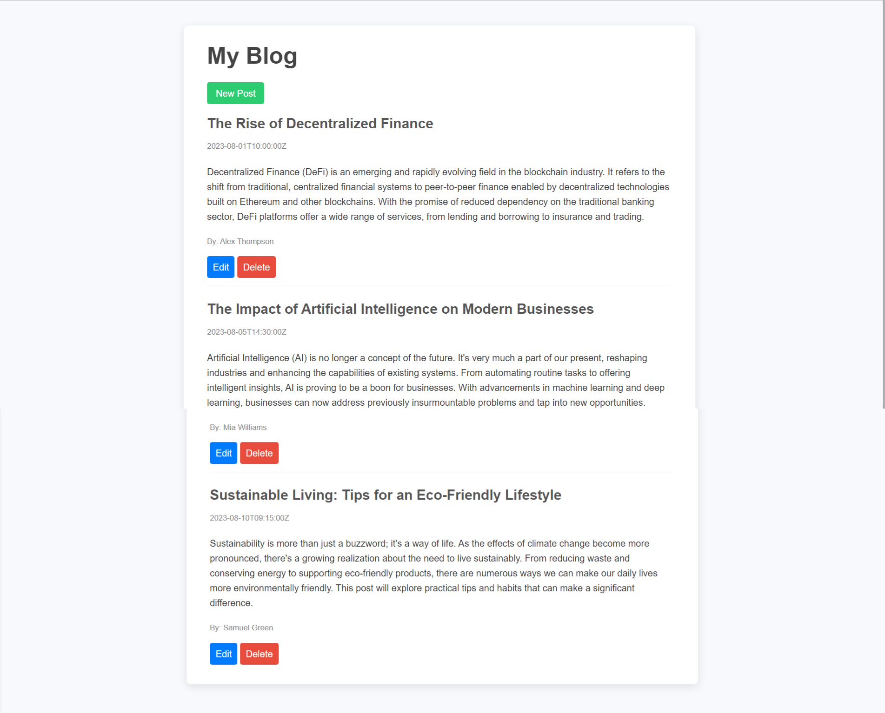
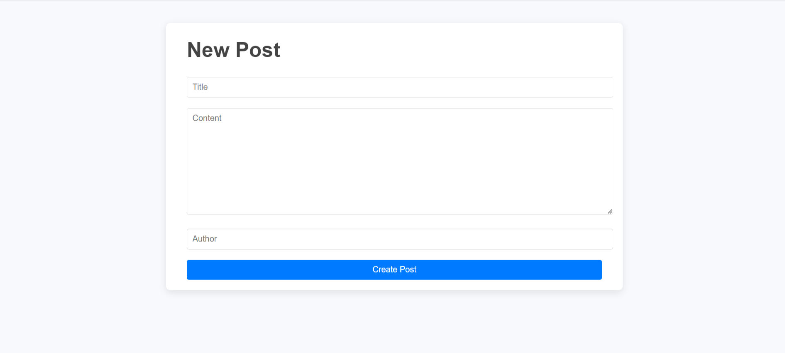

# README.md

## Project Title: Blog API and Frontend

This project consists of a simple blog application built using Node.js, Express, and EJS for rendering HTML views. The application allows users to create, read, update, and delete blog posts through a RESTful API.

## Features

- **Create Posts**: Users can create new blog posts.
- **Read Posts**: Users can view all posts or a specific post by ID.
- **Update Posts**: Users can edit existing posts.
- **Delete Posts**: Users can remove posts from the blog.

## Technologies Used

- **Node.js**: JavaScript runtime for building the application.
- **Express**: Web framework for Node.js to handle routing and middleware.
- **EJS**: Templating engine for rendering HTML views.
- **Axios**: Promise-based HTTP client for making requests to the API.

### Prerequisites

- Node.js (version 14 or higher)
- npm (Node package manager)

### Installation

1. Clone the repository:

   ```bash
   git clone <repository-url>
   cd <repository-folder>

2. Install dependencies:
    ```bash
    npm install
### Running the Application
1. Start the API server:
    ```bash
    node index.js
The API will run on http://localhost:4000.

2. Start the frontend server:
    ```bash
    node server.js
The frontend will run on http://localhost:3000.

3. Open your browser and navigate to http://localhost:3000 to view the blog.

### API Endpoints

- GET /posts: Retrieve all posts.
- GET /posts/:id: Retrieve a specific post by ID.
- POST /posts: Create a new post.
- PATCH /posts/:id: Update an existing post by ID.
- DELETE /posts/:id: Delete a specific post by ID.

### screenshots:

